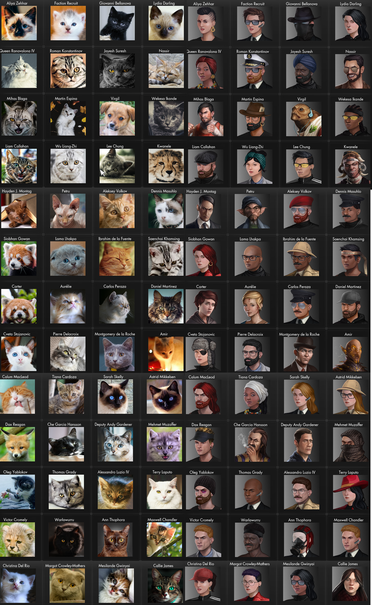

# AgentMittens  
  
Replaces agent portraits with kittens.  
  
**Install**  
Unzip to `Secret World Legends\Data\Gui\Custom\Flash\` folder.
	
All images can be replaced by replacing the image files at MittenRoster folder.  
When replacing images filetype has to be .png, and dimensions should be 200x200, although larger images may work too.  

You can also edit AgentConfig.xml file to change agents name, profession, age, gender, or species.

